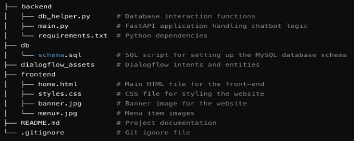

**Restaurant Chatbot Project**

**Overview**

This project is an NLP-based chatbot built using Dialog Flow to handle real-time food ordering, order tracking, and user interactions. The chatbot is integrated with a FastAPI backend and utilizes a MySQL database to manage and store user orders. The front-end is a responsive website built with HTML and CSS, offering users an intuitive interface to interact with the chatbot and view the restaurant's menu, location, and contact details.

**Features**

- **Natural Language Processing (NLP):** Chatbot powered by Dialog Flow to handle various user intents such as placing new orders and tracking existing orders.
- **Backend:** FastAPI framework for managing API requests between the chatbot and the database.
- **Database:** MySQL database with stored procedures and functions for efficient order storage and retrieval.
- **Frontend:** Responsive website created using HTML and CSS to display the restaurant menu, location, and contact details.
- **Order Tracking:** Allows users to track their previous orders and place new ones.

**Project Structure**

**Technologies Used**

**Dialog Flow:** For natural language understanding and intent handling.

**FastAPI:** As the backend framework to process API requests and interact with the database. **MySQL:** Database to store user orders and manage order tracking.

**HTML/CSS:** Frontend design for the website interface.

**Usage**

Users can visit the website, view the menu, and interact with the chatbot to place or track their food orders.

The chatbot handles various intents, such as starting a new order, adding items, tracking an existing order, and answering general queries about the restaurant.

**Instructions**

You can install pip install mysql-connector and pip install "fastapi[all]"

To start fast api backend server Run this command: uvicorn main:app --reload

To install ngrok, go to https://ngrok.com/download and install ngrok version that is suitable for your OS

Extract the zip file and place ngrok.exe in a folder.

Open windows command prompt, go to that folder and run this command: ngrok http 80000 NOTE: ngrok can timeout. you need to restart the session if you see a session expired message.
