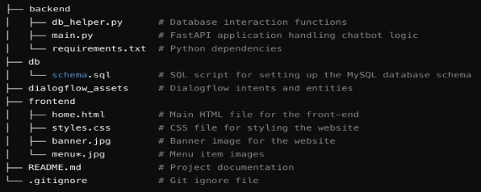
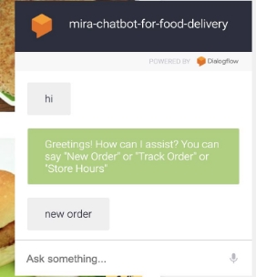
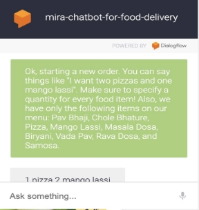
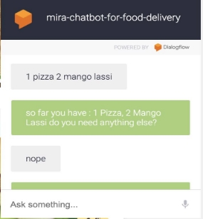
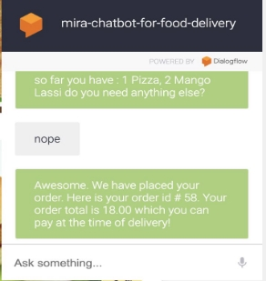
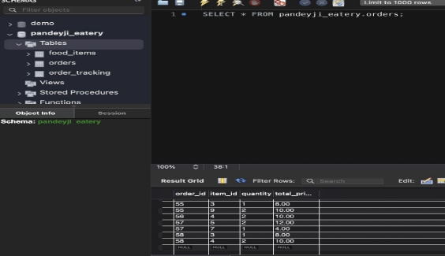

**Restaurant Chatbot Project**

**Overview**

This project is an NLP-based chatbot built using Dialog Flow to handle real-time food ordering, order tracking, and user interactions. The chatbot is integrated with a FastAPI backend and utilizes a MySQL database to manage and store user orders. The front-end is a responsive website built with HTML and CSS, offering users an intuitive interface to interact with the chatbot and view the restaurant's menu, location, and contact details.

**Features**

- **Natural Language Processing (NLP):** Chatbot powered by Dialog Flow to handle various user intents such as placing new orders and tracking existing orders.
- **Backend:** FastAPI framework for managing API requests between the chatbot and the database.
- **Database:** MySQL database with stored procedures and functions for efficient order storage and retrieval.
- **Frontend:** Responsive website created using HTML and CSS to display the restaurant menu, location, and contact details.
- **Order Tracking:** Allows users to track their previous orders and place new ones.

**Project Structure**

**Working**

This chatbot leverages Natural Language Processing (NLP), powered by Dialog Flow, to understand and respond to user queries. When a user interacts with the chatbot (e.g., placing a food order, checking order status, or inquiring about the restaurant’s details), Dialog Flow processes the natural language input and maps it to predefined intents such as "New Order" or "Track Order." Based on the detected intent, Dialog Flow triggers a webhook that sends the user's request to a FastAPI backend. The FastAPI backend serves as the logic handler for the chatbot, receiving requests from Dialog Flow and executing the necessary actions. For example, when a user places a new order, the backend processes the order details, interacts with a MySQL database, and stores the order information using stored procedures and functions. The backend also retrieves order details from the database when a user asks to track an existing order. This interaction between the chatbot and the database ensures that user data is stored and managed efficiently. The chatbot can handle real-time order modifications, such as adding or removing items from an order, and respond with confirmations or further questions. Finally, the chatbot is integrated into a responsive website built using HTML and CSS, where users can interact with it through a clean, user-friendly interface. The embedded Dialog Flow widget allows users to communicate with the chatbot directly from the website, making it an intuitive tool for ordering and tracking food in a real-time conversational manner. This architecture allows for a smooth, end-to-end flow from user input to backend processing and database management, delivering a comprehensive chatbot solution for restaurant operations.

 

 

**Technologies Used**

**Dialog Flow:** For natural language understanding and intent handling.

**FastAPI:** As the backend framework to process API requests and interact with the database. **MySQL:** Database to store user orders and manage order tracking.

**HTML/CSS:** Frontend design for the website interface.

**Usage**

Users can visit the website, view the menu, and interact with the chatbot to place or track their food orders.

The chatbot handles various intents, such as starting a new order, adding items, tracking an existing order, and answering general queries about the restaurant.

**Instructions**

You can install pip install mysql-connector and pip install "fastapi[all]"

To start fast api backend server Run this command: uvicorn main:app --reload

To install ngrok, go to https://ngrok.com/download and install ngrok version that is suitable for your OS

Extract the zip file and place ngrok.exe in a folder.

Open windows command prompt, go to that folder and run this command: ngrok http 80000 NOTE: ngrok can timeout. you need to restart the session if you see a session expired message.
